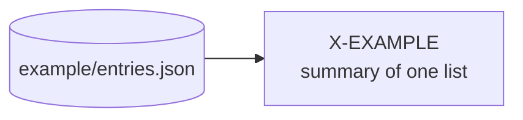

# The pipeline graph

Which generated artifact is built from which, and so what to regenerate, in what order, when
something moves.

**This page is a copy. The authority is the record, `tools/pipeline/graph.ts`.** The record
holds one entry per node: its id, its kind, the edges it declares, its named input groups, its
outputs, its generator and how its staleness is detected. `npm run pipeline:check` holds this page
to the record, and that gate is a floor: it fails when a node id in the record is missing from this
page, and when the diagram below draws a node id the record does not have. It catches a node added
on one side and forgotten on the other. **It cannot catch a wrong edge**, here or in the diagram, so
when this page and the record disagree about an edge, the record is right and this page is the
defect. The fix that ends the disagreement is to generate the diagram and the per-node sections from
the record; until an emitter does, edit both in the same commit.

kit 3.6-3 · ADAPT: replace the worked example below with your own nodes, one section each, as the
record gains them. Delete this paragraph when done.

## The graph

Boxes are nodes; a cylinder is a hand-maintained input that nothing generates. An arrow runs from
what is read to what is built from it. The check reads only labels of the shape `["X-NAME"` or
`["X-NAME `, so write a node's label as its id, then a line break, then a few words.

## The two gates

| Command | What it answers | Runs |
| --- | --- | --- |
| `npm run pipeline:check` | Does the record still describe the repository? No cycle, no unknown edge, every input, output and generator glob matches a file, every stamped path is one of its node's outputs, every script named exists, every node id appears on this page. | pre-push, CI |
| `npm run pipeline:stale:check` | Has a declared input moved since a node stamped its output? It re-folds each node's input groups into a digest and compares it with the stamp in the node's own output. It runs no generator. | pre-push, CI |
| `npm run pipeline:stale` | The same report without the exit code; `-- --verbose` adds the nodes a digest does not cover and says why for each. | by hand |

A stale report names the node, the INPUT GROUP that moved, and the command to run. The verdicts:
`OK` (the stamp matches), `STALE` (a declared input or the generator source moved: this one fails
the gate), `UNSTAMPED` (the output carries no stamp yet, so there is nothing to compare: reported,
and binding from the first run of its emitter), `ABSENT` (the output is not on disk), `SKIPPED`
(only a sibling checkout could have moved, and there is none here to ask), `PIN-DRIFT` (the sibling
checkout is ahead of the commit the output was built from: a decision, not a defect).

## Nodes

One section per node, headed by its id. Each says what the node is for, what it reads, what it
writes, how to run it, and when it is stale.

### X-EXAMPLE

The worked example, laid down by the kit so that both gates have something to assert on day one.
Kind: `DERIVED` (it re-runs whole whenever its source moves).

- Reads: the input group `example entries`, which is `tools/pipeline/example/entries.json`,
  a hand-maintained list.
- Writes: `tools/pipeline/example/summary.json`, with its stamp under the key `provenance`.
- Depends on: nothing.
- Run: `npm run pipeline:example`, then commit the result.
- STALE WHEN: `entries.json` moved, or the emitter (`example/emit.ts`) or the stamp's own
  arithmetic did, since the last run. Detection: `digest`.

It is laid down UNSTAMPED: a stamp folds the paths of the checkout it was computed in, so the kit
cannot ship one. `npm run pipeline:stale` reports it until its emitter has run here once. Remove the
node when a node of your own exists; the header of the record lists everything that goes with it.

## Adding a node

1. Write its record in `tools/pipeline/graph.ts`, with every edge DECLARED in `dependsOn`.
   An edge is never derived from the files: a derived edge says nothing about a node whose
   artifacts do not exist yet.
2. Name its input groups for what a stale report should say moved.
3. Have its emitter write `stampFor('<ID>')` into its own output (`example/emit.ts` is the shape),
   or declare `regeneration` and give its `:check` twin a pre-push job and a CI step, or declare
   `none` with the reason the gate will print.
4. Add its section here and its label to the diagram, in the same commit.
5. Run `npm run pipeline:check`. It names the side that was forgotten.

## Retiring a node, or a kind

Remove the record, this page's section and the diagram label in one commit, and leave a
do-not-re-add note where the record stood; the header of the record gives the note's shape. A KIND
whose defining property is that nothing depends on it describes a tool, not a node: retire the kind
with its last member, narrow the type, and delete the assertion that existed only for it.
